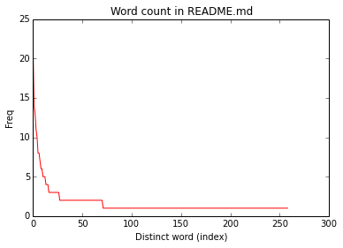

# Spark intro

Tue 19 Jan 2016 17:21:58 EST

## Overview

Introduction to Spark: single-node installation, pyspark, basic variables and objects.  

Index:

* Overview
* [Basic Setup & Starting](#basic-setup-run)
* [Current Installation](#current-installation)
* [Basic Spark Concepts](#basic-spark-concepts)
      * [Examining types](#examining-types)
      * [Things we can do on "lines" RDD](#things-we-can-do-on-lines-rdd)
        * [Functions and collect](#functions-and-collect)
        * [map(), take(),flatMap(), reduceByKey(): histograms](#map-takeflatmap-reducebykey)
        * [Word Count](#word-count)
* [Spark Console Output](#spark-console-log)
      * [Section: Current Installation](#section-current-installation)


## [Basic Setup & Run](#overview)

Working with iPython
```bash
IPYTHON=1 ./bin/pyspark
```
or with iPython Notebook
```
IPYTHON_OPTS="notebook" ./bin/pyspark
```

## [Current Installation](#overview)

Download Spark from [Spark website](https://spark.apache.org/downloads.html/). For testing purposes, download the package type "pre-built for Hadoop 2.6 or later", or whatever the version you what to download.

I installed Spark 1.6 in a VirtualBox instance of Ubuntu 14.4 within my MacbookPro under OSX 10.6.8. I want to control spark testing through an ipython notebook that I can access directly from my OSX.

To point iptyhon notebook to listen on a particular ip -without opening a browser on the console right away
```bash
iptyhon notebook --no-broswer --ip=192.168.56.102
```
The notebook will be accessible on port 8888.

In order to do that with spark we issue
```
IPYTHON_OPTS="notebook --no-browser --ip=192.168.56.102" ./bin/pyspark
```
In this case, we run it from within the directory containing the .bin/ folder of Spark's distribution. All files and paths will be relative to this directory.

It's quite convenient testing/learning with iPython Notebook. If we write
```
lengthDist.reduceByKey()
```
and wait a sec, the notebook will show a floating window with the definition of "reduceByKey":
```
lengthDist.reduceByKey(self, func, numPartitions=None, partitionFunc=<function portable_hash at 0x7f6a980938c0>)

Merge the values for each key using an associative reduce function.

This will also perform the merging locally on each mapper before
sending results to a reducer, similarly to a "combiner" in MapReduce.

Output will be partitioned with C{numPartitions} partitions, or
the default parallelism level if C{numPartitions} is not specified.
Default partitioner is hash-partition.

>>> from operator import add
>>> rdd = sc.parallelize([("a", 1), ("b", 1), ("a", 1)])
>>> sorted(rdd.reduceByKey(add).collect())
[('a', 2), ('b', 1)]
```


## [Basic Spark concepts](#overview)

The most basic object in Spark is an RDD, i.e., a *Resilient Distributed Dataset*. This is a distributed collection whereupon we perform **operations that get automatically parallelized**. 

We open a new notebook on the notebook server main page and issue the following
```
In [1]: lines = sc.textFile("README.md")
	lines.count()
Out[1]: 95
```

Key points:
* sc creates a "Spark Context".
* lines is an RDD. In this case out of a local file (comes with Spark distribution) 
* lines.count() does that, indeed, but it does by **collecting all data from all nodes in the cluster**! 
	* This is irrelevant in this case, as we are using a single-node setup, but it is important when working on a cluster!

Note: If you are using Firefox with RequestPolicy addon, it will make life easier if you just allow (even if only temporarilly) all out and inbound connections from the notebook server address ( 192.168.56.102 in this case). Otherwise, neither shift+enter nor ctrl+enter will work in order to execute the commands entered.

### [Examining types](#overview)
```
In [3]: sc 
Out[3]: <pyspark.context.SparkContext at 0x7f6a9809fa10>

In [4]: lines 
Out[4]: MapPartitionsRDD[1] at textFile at NativeMethodAccessorImpl.java:-2
```
### [Things we can do on "lines" RDD](#overview)
```
pythonLines = lines.filter(lambda line: "python" in line)
```
If we press (shift+)enter we can see there is no output, not even in the console. Spark has only defined "pythonLines", but not proceeded with its corresponding calculation yet!

Its type:
```
In [6]: pythonLines 
Out[6]: PythonRDD[4] at RDD at PythonRDD.scala:43
```
In this version of Spark, the output RDD ("pythonLines") is empty.
```
In [9]: pythonLines.count() 
Out[9]: 0
```

### [Functions and collect](#overview)
Let's try with searching for "spark". We can pass filter a function defined by ourselves
```
In [11]: def hasSpark(line): 
    		return "spark" in line;
	 sparkLines = lines.filter(hasSpark)
In [12]: sparkLines.count() 
Out[12]: 10
```
We can see the whole content of spakLines with 'collect()'. 
```
In [13]: sparkLines.collect() 
Out[13]: 
[u'<http://spark.apache.org/>',
 u'guide, on the [project web page](http://spark.apache.org/documentation.html)',
 u'["Building Spark"](http://spark.apache.org/docs/latest/building-spark.html).',
 u'    ./bin/spark-shell',
 u'    ./bin/pyspark',
 u'examples to a cluster. This can be a mesos:// or spark:// URL,',
 u'    MASTER=spark://host:7077 ./bin/run-example SparkPi',
 u'Testing first requires [building Spark](#building-spark). Once Spark is built, tests',
 u'["Specifying the Hadoop Version"](http://spark.apache.org/docs/latest/building-spark.html#specifying-the-hadoop-version)',
 u'Please refer to the [Configuration Guide](http://spark.apache.org/docs/latest/configuration.html)']
```

### [map(), take(),flatMap(), reduceByKey()](#overview)
Let's get a distribution of line lengths. 
First we will cull the length of a few lines. We will use a list of pairs build as follows:
```
In [29]: lengthDist=sparkLines.map(lambda line: (len(line),line)) 
In [31]: lengthDist.take(3) 
Out[31]: 
[(26, u'<http://spark.apache.org/>'),
 (76,
  u'guide, on the [project web page](http://spark.apache.org/documentation.html)'),
 (76,
  u'["Building Spark"](http://spark.apache.org/docs/latest/building-spark.html).')]
```
For the distribution we just need the line length. Thus
```
In [14]: lengthDist=lines.map(lambda line: (len(line),1)) 
In [15]: lengthDist.take(3) 
Out[15]: [(14, 1), (0, 1), (78, 1)] 
In [17]: dist=lengthDist.reduceByKey(lambda a,b: a+b).sortByKey().collect() 
In [23]: dist[len(dist)-4:] 
Out[23]: [(78, 1), (84, 2), (97, 1), (120, 2)] 
In [24]: %matplotlib inline 
	import matplotlib.pyplot as plt
	plt.plot([a for (a,b) in dist],[b for (a,b) in dist]) 
	plt.title("Line length distribution in README.md")
	plt.xlabel("len")
	plt.ylabel("freq")
Out[24]: [<matplotlib.lines.Line2D at 0x7f4b507d2390>]
```
The plot we obtain is


### [Word Count](#overview)
Let's count the word distribution in README.md
```
In [26]: wordDist=lines.flatMap(lambda line: line.split()).map(lambda word: (word,1)).reduceByKey(lambda a,b:a+b) 
	 wordDist.collect()[:4]
Out[26]: [(u'help', 1), (u'when', 1), (u'Hadoop', 3), (u'"local"', 1)]
```

We want to plot a red histogram shows counts from most frequent word to least frequent. Word will be simply indexed.
```
In [42]: wordDist=lines.flatMap(lambda line: line.split())
.map(lambda word: (word,1))
.reduceByKey(lambda a,b:a+b)
.sortBy(lambda x: x[1],ascending=False)
.collect() 
wordDist[:4] 
Out[42]: [(u'the', 21), (u'to', 14), (u'Spark', 13), (u'for', 11)]

In [46]: plt.plot([b for (a,b) in wordDist],'r') 
	 plt.title("Word count in README.md")
	plt.xlabel("Distinct word (index)")
	plt.ylabel("Freq")
Out[46]: <matplotlib.text.Text at 0x7f4b502cdd50>
```
which yields this plot


X-axis corresponds to a different index for each distinct word sort from most frequent to least.

## [Spark Console Log](#overview) 

### [Section: Current Installation](#overview)
```
Using Spark's default log4j profile: org/apache/spark/log4j-defaults.properties
16/01/19 15:03:47 INFO SparkContext: Running Spark version 1.6.0
16/01/19 15:03:48 WARN NativeCodeLoader: Unable to load native-hadoop library for your platform... using builtin-java classes where applicable
16/01/19 15:03:49 WARN Utils: Your hostname, DS resolves to a loopback address: 127.0.1.1; using 10.0.2.15 instead (on interface eth0)
16/01/19 15:03:49 WARN Utils: Set SPARK_LOCAL_IP if you need to bind to another address
16/01/19 15:03:49 INFO SecurityManager: Changing view acls to: msantos
16/01/19 15:03:49 INFO SecurityManager: Changing modify acls to: msantos
16/01/19 15:03:49 INFO SecurityManager: SecurityManager: authentication disabled; ui acls disabled; users with view permissions: Set(msantos); users with modify permissions: Set(msantos)
16/01/19 15:03:51 INFO Utils: Successfully started service 'sparkDriver' on port 44138.
16/01/19 15:03:52 INFO Slf4jLogger: Slf4jLogger started
16/01/19 15:03:52 INFO Remoting: Starting remoting
16/01/19 15:03:53 INFO Remoting: Remoting started; listening on addresses :[akka.tcp://sparkDriverActorSystem@10.0.2.15:33886]
16/01/19 15:03:53 INFO Utils: Successfully started service 'sparkDriverActorSystem' on port 33886.
16/01/19 15:03:53 INFO SparkEnv: Registering MapOutputTracker
16/01/19 15:03:53 INFO SparkEnv: Registering BlockManagerMaster
16/01/19 15:03:53 INFO DiskBlockManager: Created local directory at /tmp/blockmgr-92f54403-708c-40dc-af07-77a80af0108f
16/01/19 15:03:53 INFO MemoryStore: MemoryStore started with capacity 517.4 MB
16/01/19 15:03:53 INFO SparkEnv: Registering OutputCommitCoordinator
16/01/19 15:03:55 INFO Utils: Successfully started service 'SparkUI' on port 4040.
16/01/19 15:03:55 INFO SparkUI: Started SparkUI at http://10.0.2.15:4040
16/01/19 15:03:56 INFO Executor: Starting executor ID driver on host localhost
16/01/19 15:03:56 INFO Utils: Successfully started service 'org.apache.spark.network.netty.NettyBlockTransferService' on port 59372.
16/01/19 15:03:56 INFO NettyBlockTransferService: Server created on 59372
16/01/19 15:03:56 INFO BlockManagerMaster: Trying to register BlockManager
16/01/19 15:03:56 INFO BlockManagerMasterEndpoint: Registering block manager localhost:59372 with 517.4 MB RAM, BlockManagerId(driver, localhost, 59372)
16/01/19 15:03:56 INFO BlockManagerMaster: Registered BlockManager
2016-01-19 15:05:21.011 [NotebookApp] Using existing kernel: 7fac22e6-24fa-45db-b6a8-00cd7bad24e2
2016-01-19 15:05:21.502 [NotebookApp] Connecting to: tcp://127.0.0.1:54595
2016-01-19 15:05:21.514 [NotebookApp] Connecting to: tcp://127.0.0.1:58869
2016-01-19 15:05:21.529 [NotebookApp] Connecting to: tcp://127.0.0.1:56425
16/01/19 15:05:55 INFO MemoryStore: Block broadcast_0 stored as values in memory (estimated size 153.6 KB, free 153.6 KB)
16/01/19 15:05:56 INFO MemoryStore: Block broadcast_0_piece0 stored as bytes in memory (estimated size 13.9 KB, free 167.5 KB)
16/01/19 15:05:56 INFO BlockManagerInfo: Added broadcast_0_piece0 in memory on localhost:59372 (size: 13.9 KB, free: 517.4 MB)
16/01/19 15:05:56 INFO SparkContext: Created broadcast 0 from textFile at NativeMethodAccessorImpl.java:-2
16/01/19 15:05:57 INFO FileInputFormat: Total input paths to process : 1
16/01/19 15:05:57 INFO SparkContext: Starting job: count at <ipython-input-1-921bc6c41085>:2
16/01/19 15:05:58 INFO DAGScheduler: Got job 0 (count at <ipython-input-1-921bc6c41085>:2) with 1 output partitions
16/01/19 15:05:58 INFO DAGScheduler: Final stage: ResultStage 0 (count at <ipython-input-1-921bc6c41085>:2)
16/01/19 15:05:58 INFO DAGScheduler: Parents of final stage: List()
16/01/19 15:05:58 INFO DAGScheduler: Missing parents: List()
16/01/19 15:05:58 INFO DAGScheduler: Submitting ResultStage 0 (PythonRDD[2] at count at <ipython-input-1-921bc6c41085>:2), which has no missing parents
16/01/19 15:05:58 INFO MemoryStore: Block broadcast_1 stored as values in memory (estimated size 5.6 KB, free 173.1 KB)
16/01/19 15:05:58 INFO MemoryStore: Block broadcast_1_piece0 stored as bytes in memory (estimated size 3.4 KB, free 176.6 KB)
16/01/19 15:05:58 INFO BlockManagerInfo: Added broadcast_1_piece0 in memory on localhost:59372 (size: 3.4 KB, free: 517.4 MB)
16/01/19 15:05:58 INFO SparkContext: Created broadcast 1 from broadcast at DAGScheduler.scala:1006
16/01/19 15:05:58 INFO DAGScheduler: Submitting 1 missing tasks from ResultStage 0 (PythonRDD[2] at count at <ipython-input-1-921bc6c41085>:2)
16/01/19 15:05:58 INFO TaskSchedulerImpl: Adding task set 0.0 with 1 tasks
16/01/19 15:05:58 INFO TaskSetManager: Starting task 0.0 in stage 0.0 (TID 0, localhost, partition 0,PROCESS_LOCAL, 2156 bytes)
16/01/19 15:05:58 INFO Executor: Running task 0.0 in stage 0.0 (TID 0)
16/01/19 15:05:58 INFO HadoopRDD: Input split: file:/home/msantos/spark-1.6.0-bin-hadoop2.6/README.md:0+3359
16/01/19 15:05:58 INFO deprecation: mapred.tip.id is deprecated. Instead, use mapreduce.task.id
16/01/19 15:05:58 INFO deprecation: mapred.task.id is deprecated. Instead, use mapreduce.task.attempt.id
16/01/19 15:05:58 INFO deprecation: mapred.task.is.map is deprecated. Instead, use mapreduce.task.ismap
16/01/19 15:05:58 INFO deprecation: mapred.task.partition is deprecated. Instead, use mapreduce.task.partition
16/01/19 15:05:58 INFO deprecation: mapred.job.id is deprecated. Instead, use mapreduce.job.id
16/01/19 15:05:59 INFO PythonRunner: Times: total = 702, boot = 623, init = 74, finish = 5
16/01/19 15:05:59 INFO Executor: Finished task 0.0 in stage 0.0 (TID 0). 2124 bytes result sent to driver
16/01/19 15:05:59 INFO TaskSetManager: Finished task 0.0 in stage 0.0 (TID 0) in 1295 ms on localhost (1/1)
16/01/19 15:05:59 INFO DAGScheduler: ResultStage 0 (count at <ipython-input-1-921bc6c41085>:2) finished in 1.368 s
16/01/19 15:05:59 INFO TaskSchedulerImpl: Removed TaskSet 0.0, whose tasks have all completed, from pool
16/01/19 15:05:59 INFO DAGScheduler: Job 0 finished: count at <ipython-input-1-921bc6c41085>:2, took 1.921978 s
16/01/19 15:14:52 INFO SparkContext: Starting job: runJob at PythonRDD.scala:393
16/01/19 15:14:52 INFO DAGScheduler: Got job 1 (runJob at PythonRDD.scala:393) with 1 output partitions
16/01/19 15:14:52 INFO DAGScheduler: Final stage: ResultStage 1 (runJob at PythonRDD.scala:393)
16/01/19 15:14:52 INFO DAGScheduler: Parents of final stage: List()
16/01/19 15:14:52 INFO DAGScheduler: Missing parents: List()
16/01/19 15:14:52 INFO DAGScheduler: Submitting ResultStage 1 (PythonRDD[3] at RDD at PythonRDD.scala:43), which has no missing parents
16/01/19 15:14:52 INFO MemoryStore: Block broadcast_2 stored as values in memory (estimated size 4.8 KB, free 181.3 KB)
16/01/19 15:14:52 INFO MemoryStore: Block broadcast_2_piece0 stored as bytes in memory (estimated size 3.0 KB, free 184.3 KB)
16/01/19 15:14:52 INFO BlockManagerInfo: Added broadcast_2_piece0 in memory on localhost:59372 (size: 3.0 KB, free: 517.4 MB)
16/01/19 15:14:52 INFO SparkContext: Created broadcast 2 from broadcast at DAGScheduler.scala:1006
16/01/19 15:14:52 INFO DAGScheduler: Submitting 1 missing tasks from ResultStage 1 (PythonRDD[3] at RDD at PythonRDD.scala:43)
16/01/19 15:14:52 INFO TaskSchedulerImpl: Adding task set 1.0 with 1 tasks
16/01/19 15:14:52 INFO TaskSetManager: Starting task 0.0 in stage 1.0 (TID 1, localhost, partition 0,PROCESS_LOCAL, 2156 bytes)
16/01/19 15:14:52 INFO Executor: Running task 0.0 in stage 1.0 (TID 1)
16/01/19 15:14:52 INFO HadoopRDD: Input split: file:/home/msantos/spark-1.6.0-bin-hadoop2.6/README.md:0+3359
16/01/19 15:14:52 INFO PythonRunner: Times: total = 61, boot = 37, init = 21, finish = 3
16/01/19 15:14:52 INFO Executor: Finished task 0.0 in stage 1.0 (TID 1). 2143 bytes result sent to driver
16/01/19 15:14:52 INFO DAGScheduler: ResultStage 1 (runJob at PythonRDD.scala:393) finished in 0.154 s
16/01/19 15:14:52 INFO DAGScheduler: Job 1 finished: runJob at PythonRDD.scala:393, took 0.255668 s
16/01/19 15:14:52 INFO TaskSetManager: Finished task 0.0 in stage 1.0 (TID 1) in 155 ms on localhost (1/1)
16/01/19 15:14:52 INFO TaskSchedulerImpl: Removed TaskSet 1.0, whose tasks have all completed, from pool
```
