# Noise: Variance and Tail
Thu 23 Jun 2016 13:56:14 EDT

## Overview
I want to quickly write down a reminder than often gets forgotten. At least, it happened now while I was trying to get 
the right priors for a bayesian analysis of two groups in **R**.

Index:
* [Overview](#overview)
* [Intro](#intro)
* [Comparing Variances](#comparing-variances)
* [Limit of large variance](#limit-of-large-variance)
* [Conclusions](#conclusions)
* [Appendix: R script](#appendix)

## [Intro](#overview)
I have a cron job that, when connected to my mobile internet provider, every 2 hours sends 100 ping packets to Google's DNS servers at 8.8.8.8 and 8.8.4.4. Once I get enough data, I want to check the quality of service of my internet connection (find "dark" time frames, routing differences, regular congestions,...). 

For the bayesian statistical analysis I'm testing the scripts [BEST](http://www.indiana.edu/~kruschke/BEST/) by [John K. Kruschke](http://www.indiana.edu/~kruschke/).  I'm using [**RStudio**](http://rstudio.com/) for Ubuntu 14.04 in a virtual machine on my Snow Leopard (yikes!) laptop.

Long story short, not being convinced I was using the right priors, I decided I should check I had all notation and values under control. Was I using all R functions correctly? Are these t-student prior distributions really the ones I think I'm using?  Am I describing those outliers properly with the parameter values I'm choosing?

I decided to compare the t-student R-functions (dt(...), rt(...)) to those for a gaussian.  As stated in [Wikipedia](https://en.wikipedia.org/wiki/Student%27s_t-distribution), a t-student probability density has a longer tail than a (*corresponding*) gaussian distribution. Here, *corresponding* means same mean and variance. These two values uniquely specify a gaussian distribution as the latter is characterized by having all cummulants higher than 2nd order identically zero.  How this may lead to a larger tail for a t-student is something I'll leave for a subsequent update of this post.

## [Comparing variances](#overview)
Which of the following probability distributions have a larger *variability*? Try to come up with a quick, but reasonable answer before reading further.

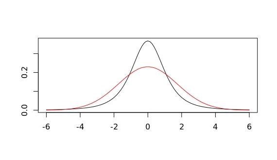

If I now tell you that the one in red corresponds to a gaussian and that in black to a t-student, does it make it easier?  The gaussian clearly seems to have a broader range of higher probability values than the t-student (more or less for all value within $1.5<|x|<4$). So, would you say the gaussian shows a higher *variability*.

Our intuitions about what *variability* means might well be misguided. I was convinced this gaussian would show a higher *dispersion* (another fancy metaphor still too ambiguous) of values. But enough with misleading terms. We all know how to **measure** the variability (or dispersion, or...) of a random variable.

Here the R-code for that plot
```
#degrees of freedom & standard deviation
df=3 ; s = sqrt(df/(df-2))
#domain range to plot
low=3*2*(m-max(m,1)) ; high=3*max(2*m,2)
#t-student dist. 
plot(function(x) dt(x,df),low,high,ylab="",xlab="") ; 
#gaussian dist.
curve(dnorm(x,m,s),from=low,to=high,n=101,col="red", add = TRUE)
```
Let me give you another hint, both distribution in that plot have the same variance!  The variance of a t-student with $df>2$ degrees of freedom is $v=df/(df-2)$. The standard deviation of the gaussian plotted exactly corresponds to such a variance.

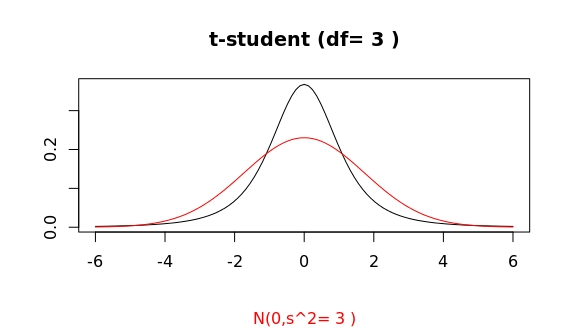

Well, that clarifies one point. Yet, the guassian clearly has a broader "head" within the interval we mentioned. Is this already then the *tail* region? That is, sampling at random values from both distributions as plotted, would the gaussian sample show every now and then larger (and or more frequent) outliers than the corresponding t-student?

Well, according to all references, this shouldn't be the case. But let's do the sampling and judge then.

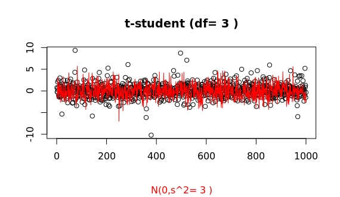

Now we can clearly see that both distribution show a comparable variance (in fact identical -ignoring for now imprecisions in the algorithms R is using for sampling both): the main glob of point in both samples is limited to basically the same range. 

Furthermore, it is also clear that the t-student shows larger outliers than the gaussian. This is a stochastic process, so repeating the sampling will show some variability, but one can easily convince oneself that indeed things work as supposed, despite the misleading look of both probability densities. 

Here some more samples.  Sometimes the outliers do not seem that much larger...

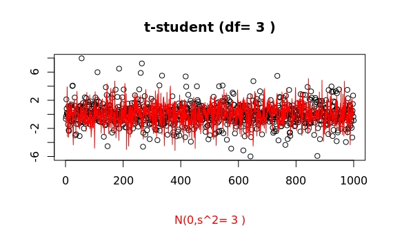
but this a random process, and for such low df values...
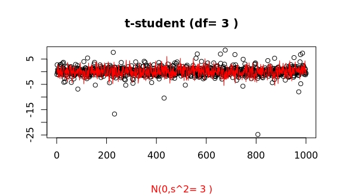
we can often find huge surprises: 
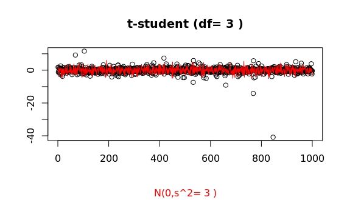
This last sample shows a huge outlier of more than 20 times larger that the standard deviation! To get some perspective of how huge such outlier is the probability to get such a large deviation for a gaussian distribution is less than 10^-116 !! I can't imagine any case (theoretical or not) where this value can't be just equated to 0.

(In R, you may issue ``` pnorm(-23)*2 ``` to get the probability of such an (gaussian) outlier at either end.)

## [Limit of large variance](#overview)
This is the case of $$df\to\infty$$ where the t-student tends to a gaussian of variance $$df/(df-2)$$.

For df=100 a simple plot of both distribution seems to show already a convergence.
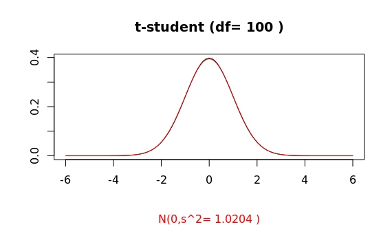

However, this is (again) highly misleading, as a sampling may show: 
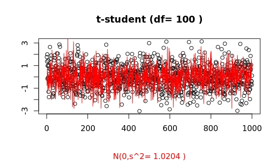
A closer look at the tails shows: 
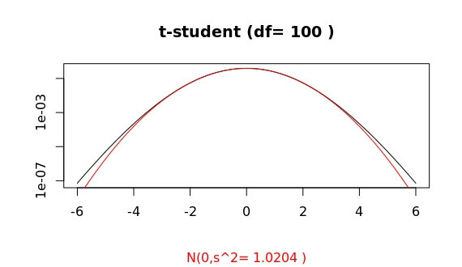

Compare this to the cases of df=10 and df=1000:
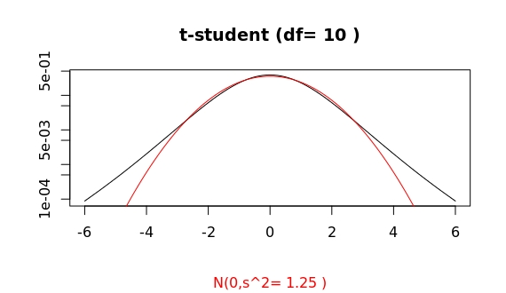
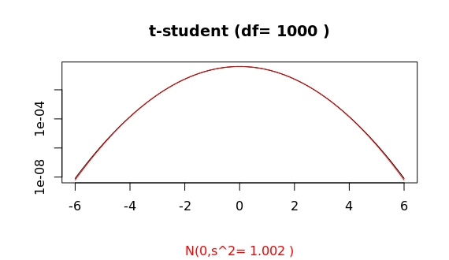
Thus, for an apparently already large value of df=100, the algorithms in R show a clear distinct asymptotic behaviour of both distributions. 

This is how some samplings look like (whatch for those systematic large outliers of the t-student as compared to the gaussian):

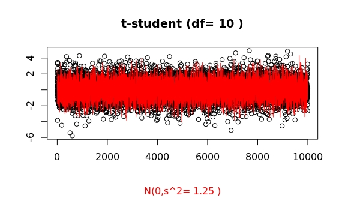
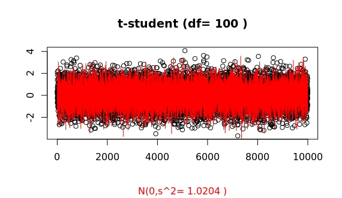
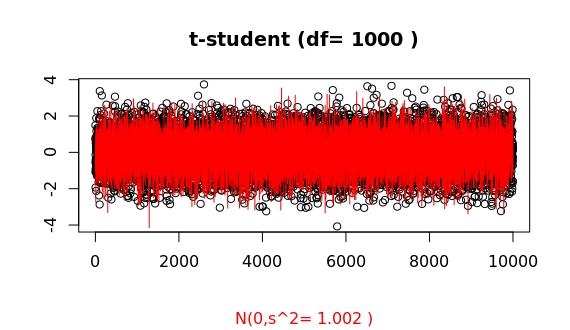


For df=100 the probability of having an outlier larger than 4 times the standard deviation is 2 times higher for the t-student as compared to the gaussian case (in R, issue ```pt(-4,df=100)/pnorm(-4)```). For df=1000, both probabilities are basically equal (1.07). This ratio, as a function of deviation x from the mean, f(x), grows as a double exponential: the extreme value distribution. 
 
## [Conclusions](#overview)
The tail of a prob. density function $f(x)$ controls the frequency of very large outliers. Mathematically it is determined  by the limit behavior (e.g., for the right tail) $\lim_{x\to\infty}f(x)$. A closer look at those density plots shows that for $|x|>5$ the probability for outliers is higher for the t-student case than for the coresponding gaussian distribution. A log scale for the y-axis helps in visualizing this.

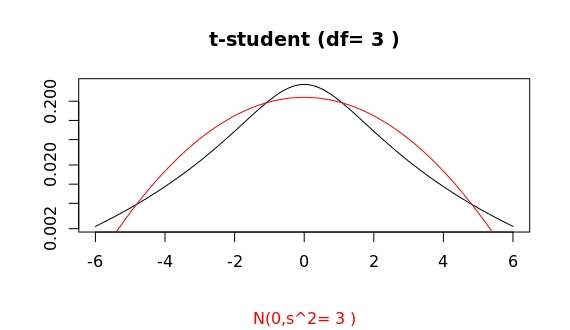

In summary, the difference in both density plots can roughly be explained as follows: For the guassian distribution the values *constantly* fluctuate bettween say x=-4 and 4, but *extremely unlikely beyond that range*. However, for a t-student distribution, the values *mostly stay within a narrower band*, but, in comparison, there are *very frequent (as in very likely), large fluctuations* way beyond that range. This compensates that narrower "head" we see to give the same variance for both distributions. 

As a final take-home message, it is only meaningful to compare the *spread* in two density plots when they correspond to the **same probability distribution type**. otherwise the tails need to be taken into account.
 
## [Appendix](#overview)
You can use the R-script below to check the plots for different values of the variance. This last plot can be obtained by issuing
```
tvsg(3,tails=TRUE)
```
A sampling of points comparing both distribution 
```
sampleTvsG(df=3)
```

The R-script:
```
#Comparing t-student and Gaussian
# Provides 2 functions:
#tvsg(df,noncentered,m,rounding,showlabel)
#sampleRvsG(n,df,rounding,showlabel)
#Running this script will call tvsg with the following default values.
#m:= mean ; df:= degree of freedom ; s:=standard deviation
# g:= 0 -> t-centered ; 1-> t=(U-mu)/Xi2/sqrt(df)
#
mean=10 ; degf=10 ;  nc=0 ; roundig=4 ; showlab=TRUE ; showtails=FALSE
#Plot both prob. density functions for same mean and variance.
tvsg <- function(df=degf,noncentered=nc,m=mean,rounding=roundig,showlabel=showlab,tails=showtails){
  tv=df/(df-2) ; tvplt=round(tv,digits = rounding)
  s=sqrt(tv)
  if (noncentered==0) m=0
  #domain range to plot
  low=3*2*(m-max(m,1)) ; high=3*max(2*m,2) ;
  #log-scale for y-axis will enhance the tail
  logscale=""
  if (tails) logscale="y"
  #t-student
  if (noncentered) {
    s=1.33*(0.05*(m-10)+1.25) ;
    plot(function(x) dt(x,df,m),low,high,ylab="",xlab="",log=logscale) ; 
    #plot(function(x) (dt(x,df,m)*(1-g)+g*dt(x,df)),low,high,ylab="",xlab="") ; 
  } else {
    plot(function(x) dt(x,df),low,high,ylab="",xlab="",log=logscale) ; 
  }#add Gaussian
  curve(dnorm(x,m,s),from=low,to=high,n=101,col="red", add = TRUE, log=logscale)
  if (showlabel)
    title(paste("t-student (df=",df,")"),sub = paste("N(0,s^2=",tvplt,")"),col.sub="red")
}
#Plot sampling of n points of both distributions to show difference between 
# variance and tail, aka. outliers
sampleTvsG<-function(n=1000,df=degf,rounding=roundig,showlabel=showlab){
  tv=df/(df-2) ; tvplt=round(tv,digits = rounding)
  s=sqrt(tv)
  plot(1:n,rt(n,df),ylab = "",xlab = "");
  lines(1:n,rnorm(n,0,s),col="red")
  if (showlabel)
    title(paste("t-student (df=",df,")"),sub= paste("N(0,s^2=",tvplt,")"),col.sub="red")
}
tvsg()
```

